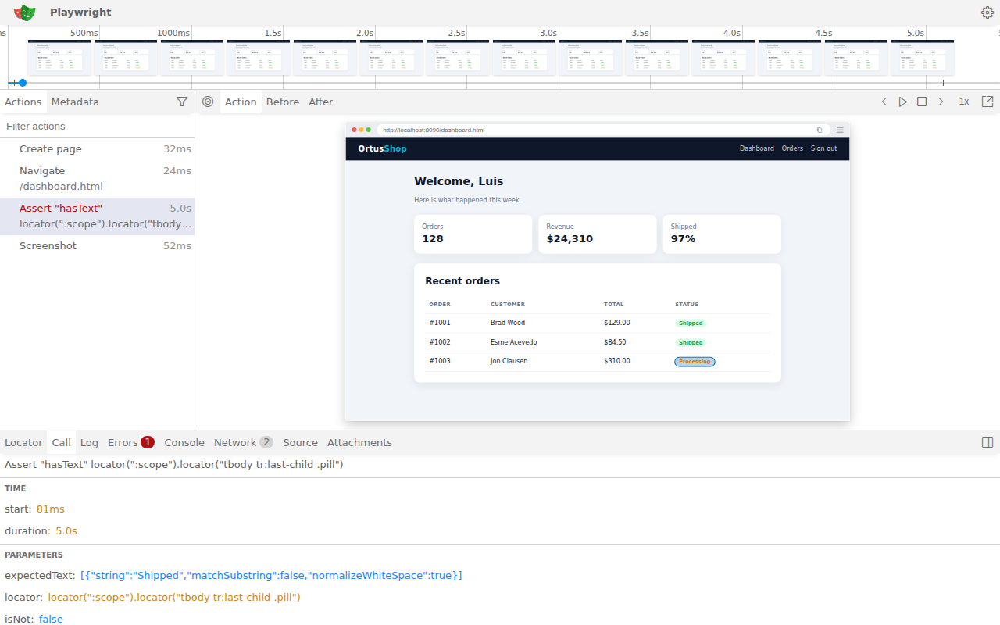
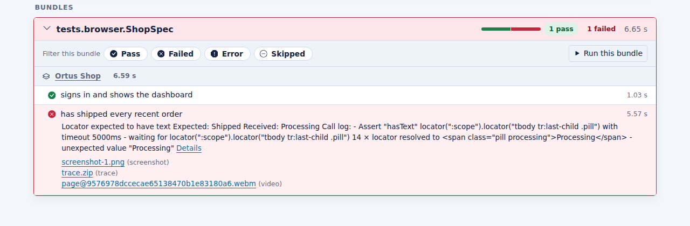

# BxPlaywright

Drive Chromium, Firefox and WebKit from BoxLang: test web apps, mock the network, test APIs, check accessibility, compare screenshots, and render HTML to PDF or images.

```js
playwright().visit( "https://boxlang.io" )
	.assertTitleContains( "BoxLang" )
	.click( "Docs" )
	.screenshot( "docs.png" )
	.quit()
```

## See it in action

A TestBox `BrowserSpec` signing in to a demo shop and checking the dashboard:


When a test fails, the `ci` profile keeps a screenshot, a trace and a video. Here the spec expected the last order to be `Shipped`:


`bxPlaywright show-trace` replays every action with the DOM, console and network:



TestBox attaches all three to the failing spec in its report:



## What you get

| Piece | What it is |
|---|---|
| `playwright()` | The BIF that returns a manager: pages, contexts, one-shot helpers |
| Page and Locator | Chainable actions, smart selectors, web-first assertions |
| `bx:playwrightRender` | A component that renders its body to PDF, PNG, JPEG or WebP |
| `bxPlaywright` | The CLI: install browsers, doctor, codegen to BoxLang, trace viewer, MCP |

## Two distributions

| Module | Size | Node.js |
|---|---|---|
| `bx-playwright` | ~4 MB | downloaded by `bxPlaywright install` |
| `bx-playwright-full` | ~206 MB | bundled for every platform, works offline |

Same module name (`playwright`), same API. Install one of them.

Next: [Getting Started](getting-started.md).

Framework guides: [TestBox Browser Testing](testbox.md) and [BoxLang Web Applications](web-applications.md).
